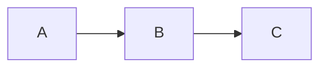
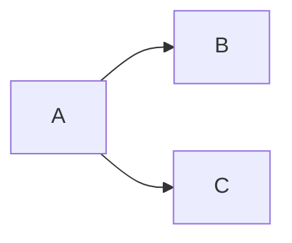
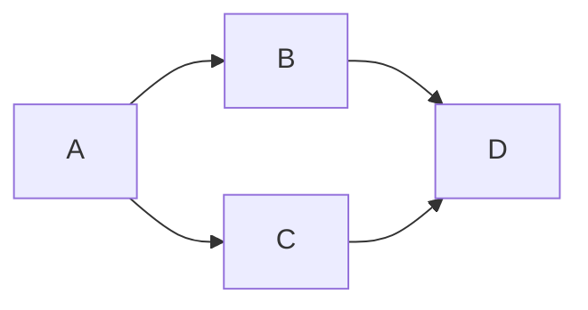

# Argo Workflows Guide

## Basic Structure

```yaml
apiVersion: argoproj.io/v1alpha1
kind: Workflow
metadata:
  name: workflow-name
spec:
  serviceAccountName: argo
  entrypoint: main-template    # First template to execute
  arguments:                   # Global parameters
    parameters:
    - name: param-name
      value: "default-value"
  templates:
    # Template definitions
```

## DAG (Directed Acyclic Graph)

DAG allows you to define task dependencies and control parallel/sequential execution.

### Basic DAG Structure

```yaml
templates:
- name: dag-template
  dag:
    tasks:
    - name: task-a
      template: template-a

    - name: task-b
      template: template-b
      dependencies: [task-a]    # Runs after task-a completes

    - name: task-c
      template: template-c
      dependencies: [task-a]    # Runs after task-a (parallel with task-b)

    - name: task-d
      template: template-d
      dependencies: [task-b, task-c]  # Multiple dependencies
```

### Dependency Patterns

**Sequential**


**Parallel**


**Diamond**


## Parameter Passing

### Referencing Global Parameters

```yaml
# Reference parameters defined in workflow.parameters
value: "{{workflow.parameters.param-name}}"
```

### Passing Parameters Between Tasks

```yaml
dag:
  tasks:
  - name: task-a
    template: template-a
    arguments:
      parameters:
      - name: input-param
        value: "{{workflow.parameters.global-param}}"

  - name: task-b
    template: template-b
    dependencies: [task-a]
    arguments:
      parameters:
      - name: input-param
        value: "{{tasks.task-a.outputs.parameters.output-param}}"
```

### Defining Parameters in Templates

```yaml
- name: my-template
  inputs:
    parameters:
    - name: param-name
  container:
    image: my-image
    args:
      - "--param={{inputs.parameters.param-name}}"
```

## Common Variables

| Variable | Description |
|----------|-------------|
| `{{workflow.name}}` | Workflow name |
| `{{workflow.uid}}` | Workflow UID |
| `{{workflow.parameters.NAME}}` | Global parameter |
| `{{inputs.parameters.NAME}}` | Template input parameter |
| `{{tasks.TASK.outputs.parameters.NAME}}` | Output from another task |
| `{{steps.STEP.outputs.parameters.NAME}}` | Output from another step |

## Container Template

```yaml
- name: container-template
  inputs:
    parameters:
    - name: message
  container:
    image: alpine:latest
    command: [sh, -c]
    args: ["echo {{inputs.parameters.message}}"]
    env:
    - name: ENV_VAR
      value: "value"
    - name: SECRET_VAR
      valueFrom:
        secretKeyRef:
          name: secret-name
          key: key-name
    resources:
      requests:
        memory: "256Mi"
        cpu: "100m"
      limits:
        memory: "512Mi"
        cpu: "200m"
```

## Steps vs DAG

### Steps (Sequential/Parallel Control)

```yaml
templates:
- name: steps-template
  steps:
  - - name: step1          # First step
      template: template-a
  - - name: step2a         # Parallel execution
      template: template-b
    - name: step2b
      template: template-c
  - - name: step3          # After step2a and step2b complete
      template: template-d
```

### DAG (Dependency-Based)

DAG is better suited for complex dependencies, with explicit control via `dependencies`.

## Conditional Execution

```yaml
dag:
  tasks:
  - name: conditional-task
    template: my-template
    when: "{{tasks.previous.outputs.result}} == success"
```

## Output Parameters

```yaml
- name: output-template
  container:
    image: alpine
    command: [sh, -c]
    args: ["echo -n 'result' > /tmp/output.txt"]
  outputs:
    parameters:
    - name: result
      valueFrom:
        path: /tmp/output.txt
```

## Retry Strategy

```yaml
- name: retry-template
  retryStrategy:
    limit: 3
    retryPolicy: "OnError"
  container:
    image: my-image
```

## Example in This Repository

`producer-consumer-workflow.yaml` uses the following DAG pattern:

```
Producer -> Consumer
```

- **Producer**: Writes data to RDS
- **Consumer**: Processes data after Producer completes (`dependencies: [producer]`)

## Execution Commands

```bash
# Submit workflow
argo submit workflows/producer-consumer-workflow.yaml

# Submit with parameters
argo submit workflows/producer-consumer-workflow.yaml \
  -p batch-size=200 \
  -p batch-id=custom-id

# Check status
argo list
argo get <workflow-name>
argo logs <workflow-name>
```

## References

- [Argo Workflows Documentation](https://argoproj.github.io/argo-workflows/)
- [DAG Template](https://argoproj.github.io/argo-workflows/walk-through/dag/)
- [Variables](https://argoproj.github.io/argo-workflows/variables/)
